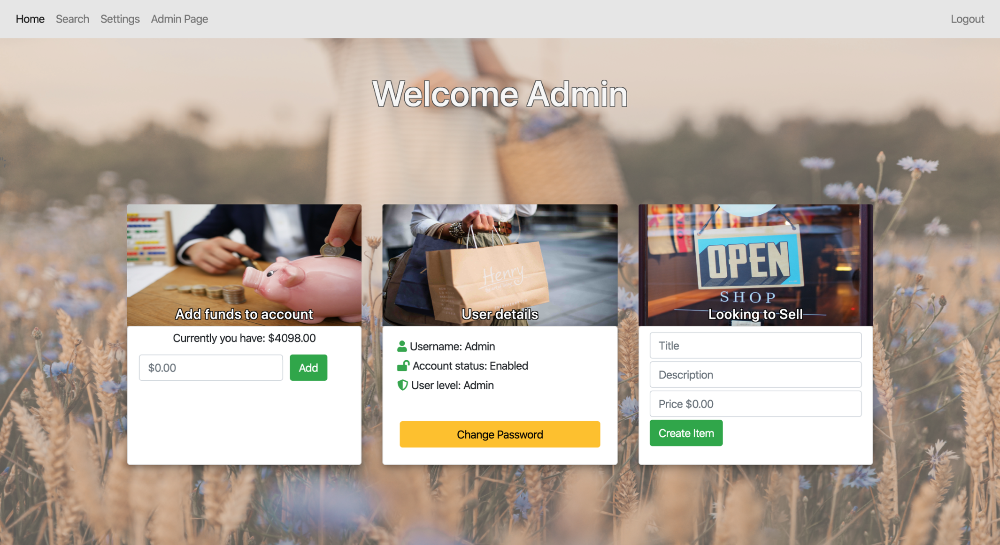
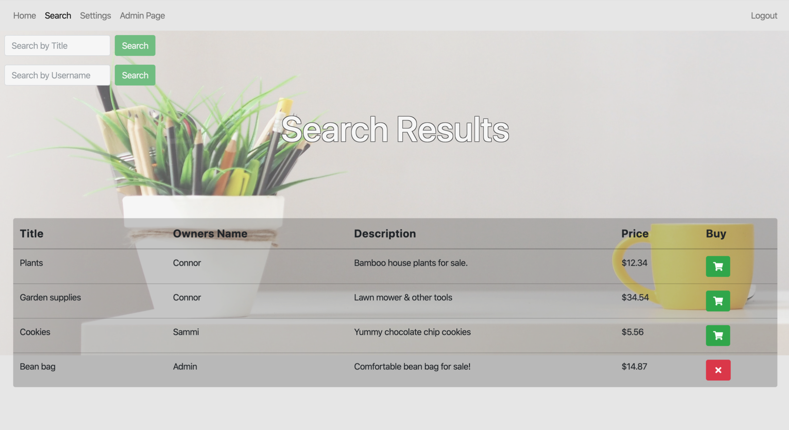
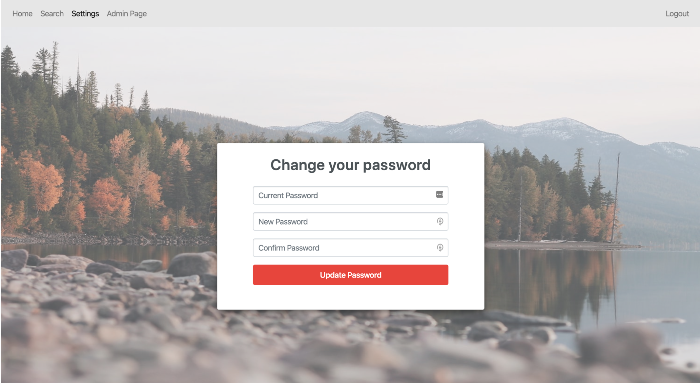
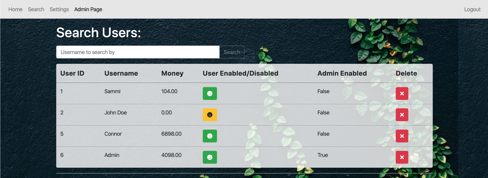
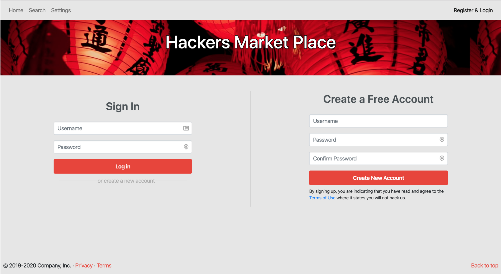

# Vulnerable Website

Welcome Page          | Search Page
:-------------------------:|:-------------------------:
 |  

* This system is set up in a virtual machine that is configured with a LAMP (Linux, Apache, MYSQL, PHP) stack setup. 
* The web application hosted on this machone allows users to buy and sell items. 
* Hidden beneath the surface are exploitable vulnerabilities such as, XSS, SQL injection, Broken Access Control and more.
* The overall aim is to explore the importance of understanding how various flaws and vulnerabilities work, how to discover and prevent them (prevention is found in README.pdf).

# Usage
The machine is configured with the static IP address of 192.168.56.150 for a host only adapter. 
The credentials for the VM is student with the password CCSEP2019. Which can be run from VirtualBox.

* To set up the database login using `mysql -u student -p` and type CCSEP2019 for the password.
    * Next, enter `source /path/to/init_schema.sql;`
    * After, enter `source /path/to/seed_data.sql;`
* Afterwards navigate to 192.168.56.150/ in the browser which will take you to the create a user/login page (index.php).

Update Password          | Admin Page
:-------------------------:|:-------------------------:
 |  

# Functionality
1. Create accounts
2. Additions of funds for users
3. Putting items up for purchase
4. Purchasing items using funds
5. Searching capability
  * Search for items by name 
  * Search for items by seller
6. Admin Features - note an Admin user has already been created with the credentials of Admin:Admin.
  * Disable/lock regular users 
  * Remove items for sale

## Current Issues & Future work: 
* Unfortunately VMs are quite large and I wasn't able to upload it. However future work will update this to a containerized method.
* *For images and a break down of the vulnerabilities and how to prevent them look at the README.pdf*

